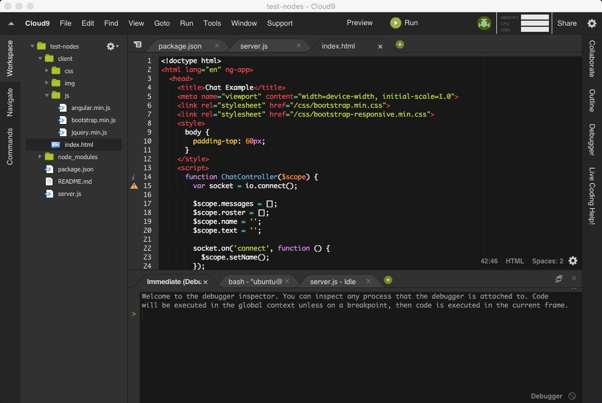

## 简介

Electron 可以让你使用纯 JavaScript 调用丰富的原生 APIs 来创造桌面应用。你可以把它看作是专注于桌面应用而不是 web 服务器的，io.js 的一个变体。

这不意味着 Electron 是绑定了 GUI 库的 JavaScript。相反，Electron 使用 web 页面作为它的 GUI，所以你能把它看作成一个被 JavaScript 控制的，精简版的 Chromium 浏览器。

## 用Electron打造一个nodejs客户端

1. 假定你已经有了文本编辑器（或者IDE），并且安装了Node.js和npm。
在终端拉取本例子：

```
# Clone this repository
git clone https://github.com/DisJo/electron-cloud9.git
# Go into the repository
cd electron-quick-start
# Install dependencies and run the app
npm install && npm start
```

2.在根目录上有一个文件`app.js`，是该脚本的主进程，在主进程运行的脚本可以以创建 web 页面的形式展示 GUI。

`app.js` 内容如下：

```
'use strict';

const electron = require('electron');
const app = electron.app;
const BrowserWindow = electron.BrowserWindow;

let mainWindow;

function createWindow() {
  mainWindow = new BrowserWindow({width: 1247, height: 750});
  mainWindow.loadURL('https://c9.io');  
  mainWindow.on('closed', function() {
    mainWindow = null;
  });
}

app.on('ready', createWindow);

app.on('window-all-closed', function () {
  if (process.platform !== 'darwin') {
    app.quit();
  }
});

app.on('activate', function () {
  if (mainWindow === null) {
    createWindow();
  }
});
```

我们这里加载了一个 “https://c9.io” 的网址，是一个nodejs的一个在线编辑器，此次的目的就是把他打包成本地应用

3.`package.json`加入打包命令：
```
"scripts": {
    "build": "electron-packager . 'Electron Cloud9' --platform=darwin --arch=x64 --version=0.36.10 --icon=assets/icon.icns --overwrite --out=./dist --ignore=./dist" 
  }
```

在终端执行

```
npm run build
```

编绎好了之后会在文件目录`/dist/Electron Cloud9-darwin-x64/` 生成.app的桌面应用

win用户也只要修改`package.json`里面的`build`脚本 `--platform=win32 --arch=ia32`即可生成windows下的`.exe`应用


